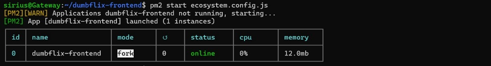

**STAGE 2**

Week 1 task 1

1.  Langkah-langkah membuat VM di BiznetGio

- Membuat akun di BiznetGio lalu login

- Klik menu Compute lalu pilih NEO Lite

>  style="width:2.24242in;height:2.87995in" />

- Kemudian klik Create New lalu isi Neo Lite Service Name dan Pilih
  Region yang tersedia

- Pada Neo Lite Flavor, pilih Product dan Cycle sesuai keinginan atau
  kebutuhan

>  style="width:3.98733in;height:3.15152in" />

- Pada Operating System pilih sesuai keinginan

>  style="width:4.03788in;height:3.02863in" />

- Pada bagian SSH Key, pilih create ssh key kemudian isi nama ssh key
  lalu create

>  style="width:3.98485in;height:2.1231in" />

- Selanjutnya pada SSH/Console username, isi ssh username yang
  diinginkan

- Terakhir isi password sesuai yang di inginkan lalu klik next untuk
  membayar dan VM selesai dibuat.

2.  Buat suatu user baru pada VM server yang telah dibuat dan
    implemantasikan ssh key

- Masuk keserver yang sudah dibuat tadi lalu buat user baru

>  style="width:4.07576in;height:2.14761in" />

- Melakukan permission pada konfiguraasi ssh agar dapat login ke user
  baru tadi dengan cara masuk ke direktori berikut lalu ubah pada
  hilangkan tanda \# dan ubah pada bagian berikut menjadi
  PubkeyAuthentication yes dan PasswordAuthentication yes.

>  style="width:4.05303in;height:2.51013in" />
>
>  style="width:4.04859in;height:2.67424in" />
>
>  style="width:4.05999in;height:2.59091in" />

- Simpan dan lakukan reload pada service sshd

>  style="width:4.06061in;height:2.20306in" />

- Melakukan login ke user baru yang telah dibuat tadi (Dengan
  menggunakan password)

>  style="width:4.12121in;height:2.20352in" />
>
>  style="width:4.15909in;height:2.21271in" />

- Sekarang melakukan login dengan meng-implementasi ssh

- Generate ssh key pada server baru tadi

>  style="width:4.15057in;height:2.23485in" />

- Masuk ke direktori .ssh lalu copy private key id_rsa

>  style="width:4.1453in;height:2.52273in" />

- Keluar dari server baru, lalu buat sebuah file .pem untuk memasukkan
  private key yang telah di copy tadi

>  style="width:4.17424in;height:2.4571in" />
>
>  style="width:4.2197in;height:2.60447in" />

- Login kembali ke user baru tadi dengan menggunakan file .pem yang
  sudah ada private key tadi

>  style="width:4.31818in;height:2.53465in" />

- Login berhasil tapi masih di minta password, untuk menghilangkan
  password maka masuk ke direktori .ssh lalu copy public key pada
  id_rsa.pub, kemudian buat file authorized_keys lalu paste public key
  tadi didalam file authorized_keys

>  style="width:4.31818in;height:2.26243in" />

- Log out kemudian masuk kembali dengan ke server baru dengan
  menggunakan file .pem tadi

>  style="width:4.26515in;height:2.30883in" />

- Dapat dilihat login ssh dengan file .pem ke server baru berhasil tanpa
  menggunakan password.

3.  Deploy aplikasi Dumpflix-Frontend dengan menggunakan nodejk versi
    14.x

- Melakukan clone aplikasi yang ingin di deploy

>  style="width:4.34091in;height:2.32003in" />

- Menginstall nvm

>  style="width:4.41987in;height:2.33333in" />

- Exec bash, lalu install npm versi 14

>  style="width:4.21212in;height:0.8834in" />

- Masuk ke direktori apliaksi yang sudah di clone tadi lalu jalankan
  perintah npm -I untuk menginstall npm

>  style="width:4.28788in;height:0.39572in" />
>
>  style="width:4.26515in;height:2.28899in" />

- Jalankan aplikasi dengan perintah npm start

>  style="width:4.21212in;height:2.23066in" />
>
>  style="width:4.26515in;height:2.29891in" />

- Buka browser lalu akses ke aplikasi dengan menggunakan ip server:3000

>  style="width:4.27715in;height:2.32576in" />

4.  Clone repository aplikasi tadi lalu deploy dengan menggunakan PM2

- Menginstall pm2 global

>  style="width:4.2803in;height:2.26013in" />

- Untuk mendefinisikan konfigurasi aplikasi maka gunakan perintah pm2
  ecosystem

>  style="width:4.26515in;height:2.28757in" />
>
>  style="width:4.26515in;height:2.26678in" />

- Ubah isi file ecosystem yang sudah di generate tadi, pada bagian name
  ubah menjadi nama aplikasi yang ingin di deploy dan pada bagian script
  ubah jadi perintah npm start (untuk menjalankan aplikasi)

>  style="width:4.32576in;height:3.02698in" />
>
>  style="width:4.38636in;height:2.40215in" />

- Jalankan aplikasi dengan perintah pm2 start ecosystem.config.js

>  style="width:4.32576in;height:0.58852in" />

- Buka browser dan coba akses ke server

>  style="width:4.49242in;height:2.44281in" />
