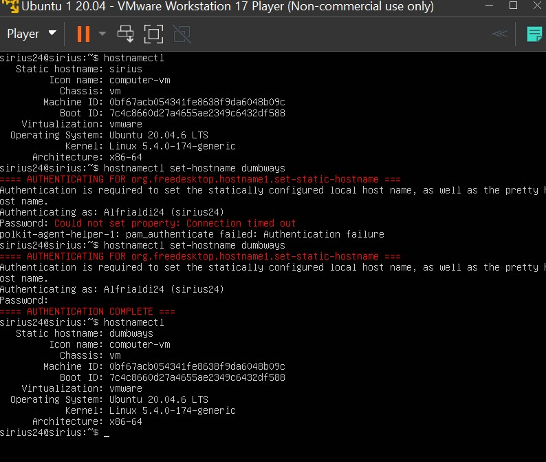

Challenge week 1

1.  Merubah nama hostname menjadi dumbways

- Untuk mengubah hostname menjadi dumbways maka dilakukan perintah
  “hostnamectl set-hostname dumbways

>  style="width:4.51899in;height:3.81706in" />
>
> Dapat dilihat hostname telah berubah dari sirius menjadi dumbways.

2.  .
