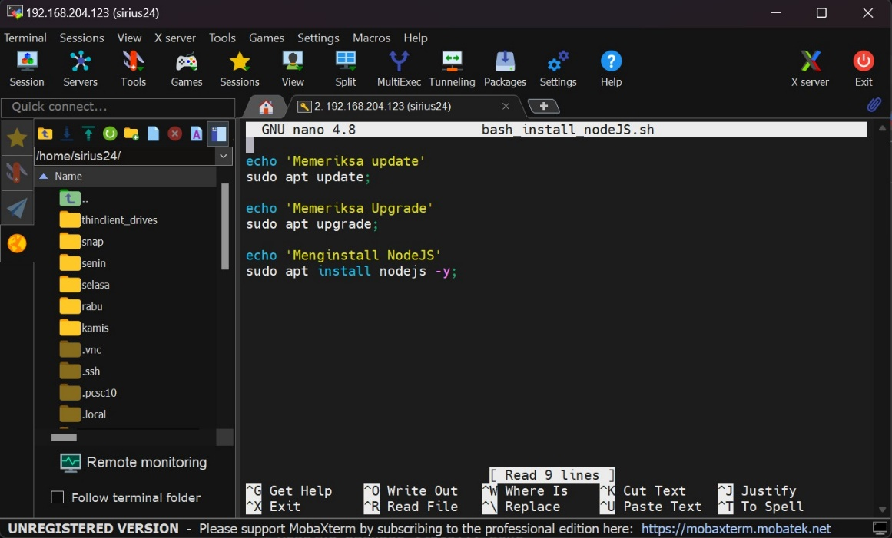
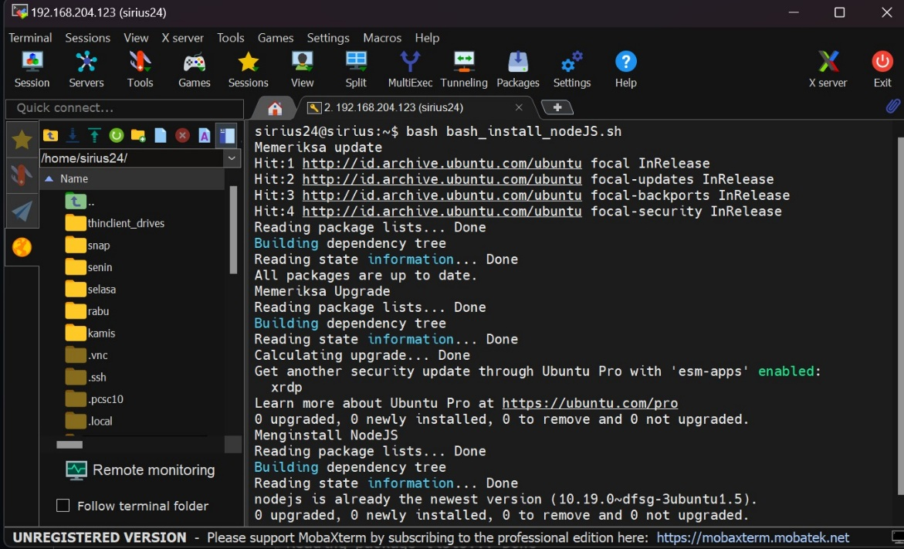
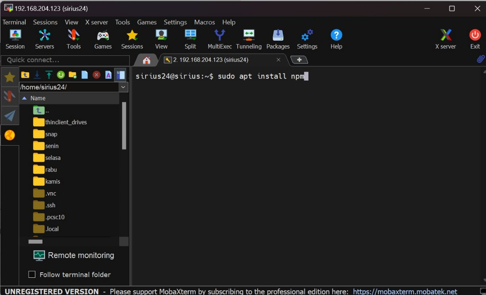
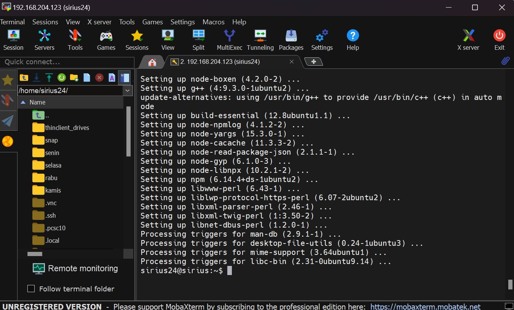
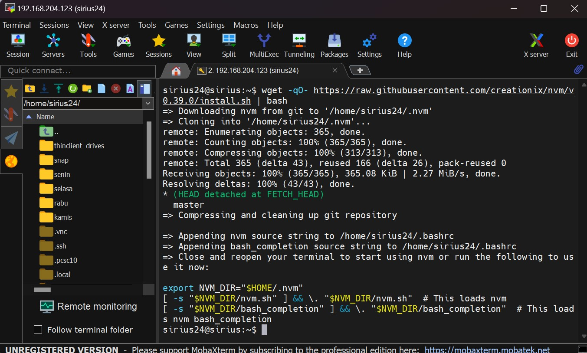
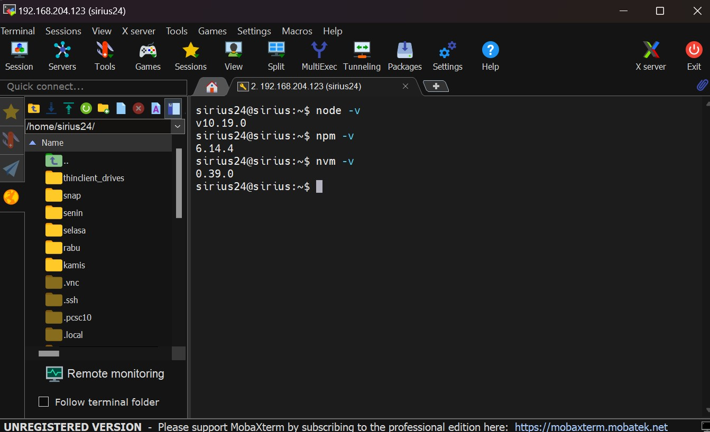

Challenge week 2

1.  Install nodeJS menggunakan BASH script

2.  Install nvm dan npm

>  style="width:5.22152in;height:3.17769in" />

3.  Mengecek versi nodeJS, npm dan nvm

>  style="width:5.20655in;height:3.17089in" />
