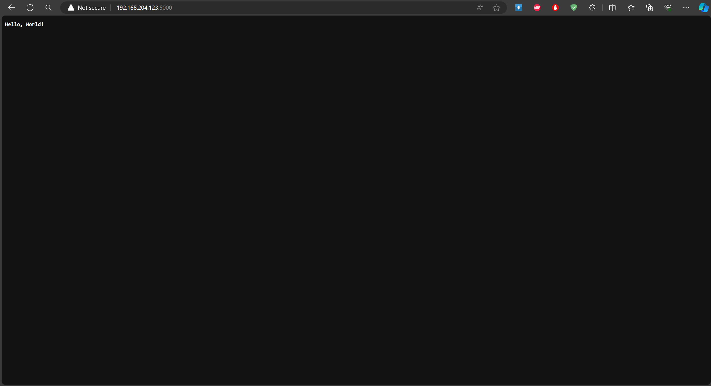

Challenge Week 3

1.  Deploy app (NodeJS, Golang) in PM2

- Instal pm2

>  style="width:5.20833in;height:3.12061in" />
>
>  style="width:5.21528in;height:3.16291in" />

- Masuk kedalam folder aplikasi yang ingin di deploy dan ketikkan
  perintah pm2 start index.js untuk melakukan deploy

>  style="width:5.20833in;height:3.14947in" />
>
>  style="width:5.21528in;height:3.12131in" />

2.  Akses golang melalui web dengan port 5000

- Membuat file tesweb.go dan masukkan script kedalamnya

> 
>
> 

- Kemudian jalankan dengan perintah go run tesweb.go

>  style="width:5.15364in;height:3.11183in" />

- Akses melalui web browser dengan cara ip:5000

>  style="width:5.18252in;height:2.81863in" />
