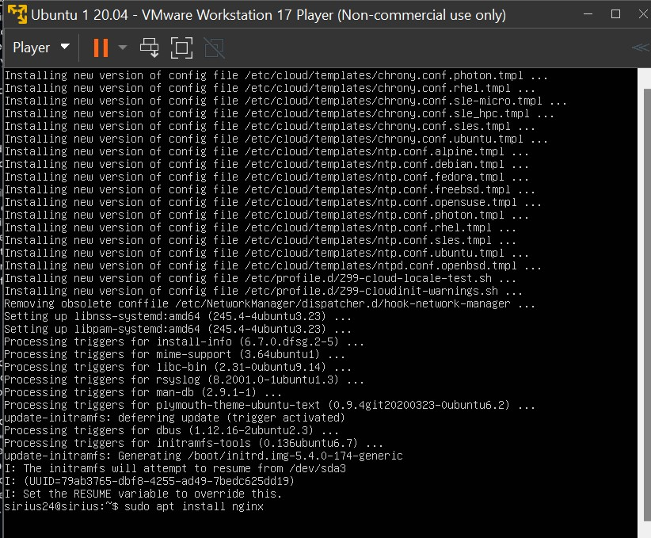
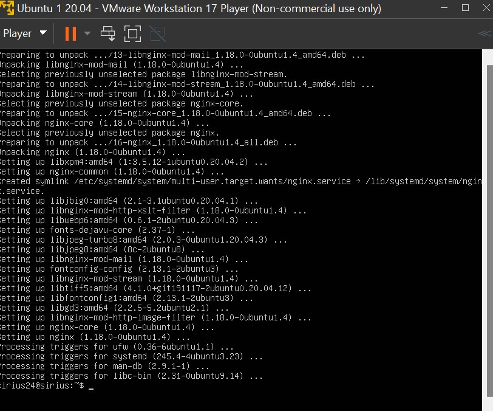
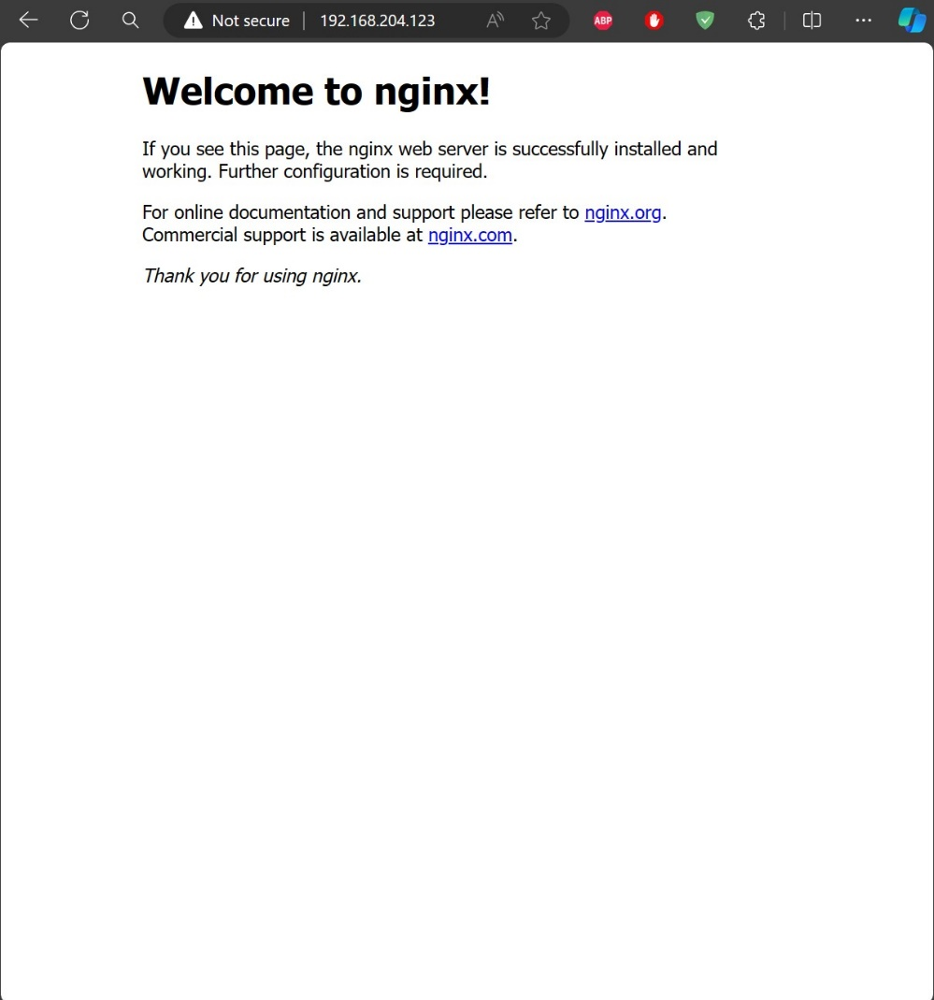
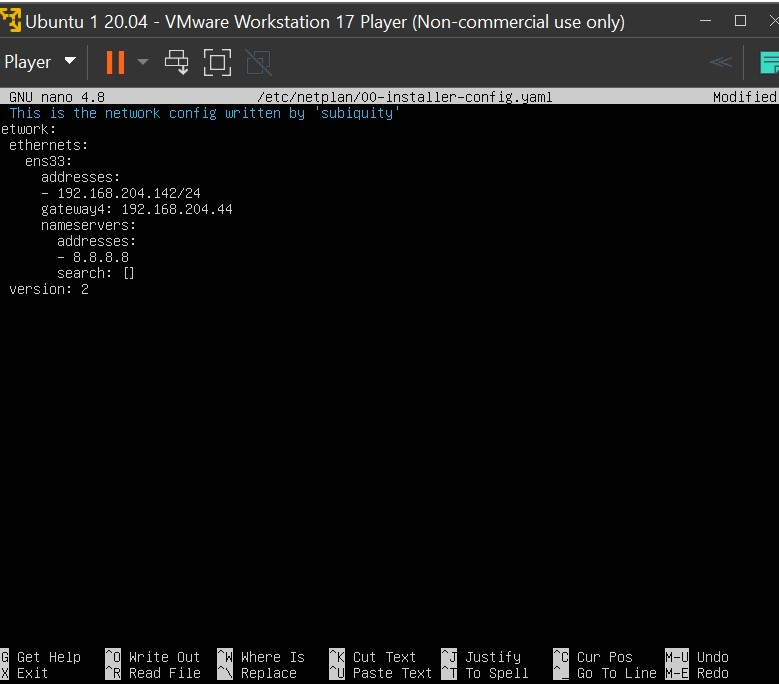
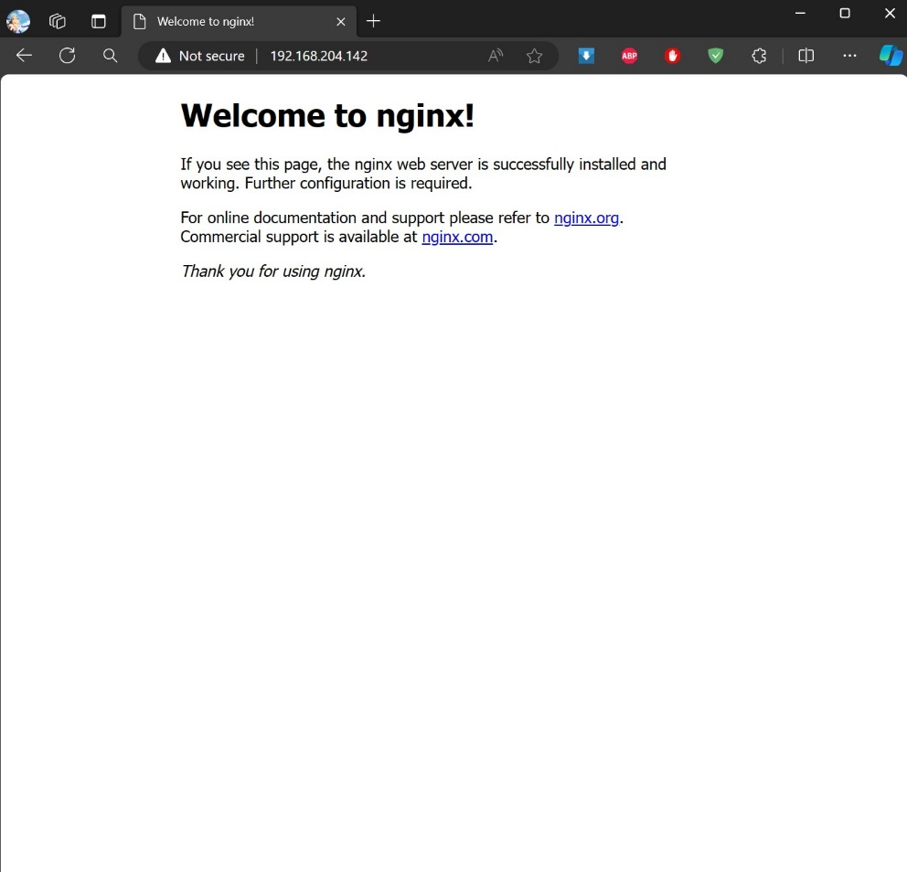
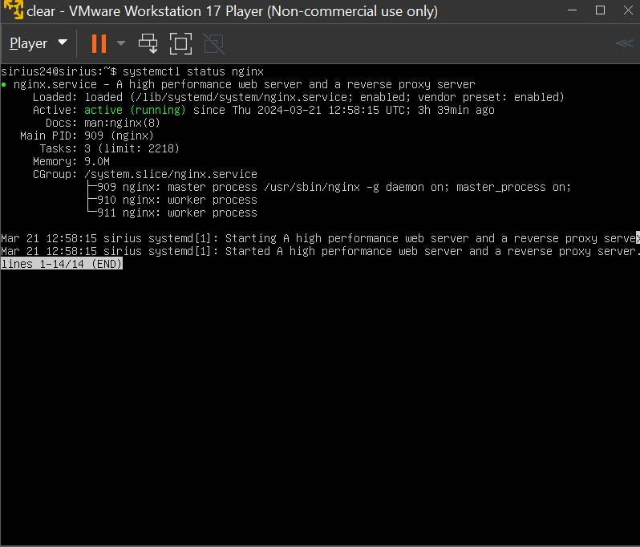
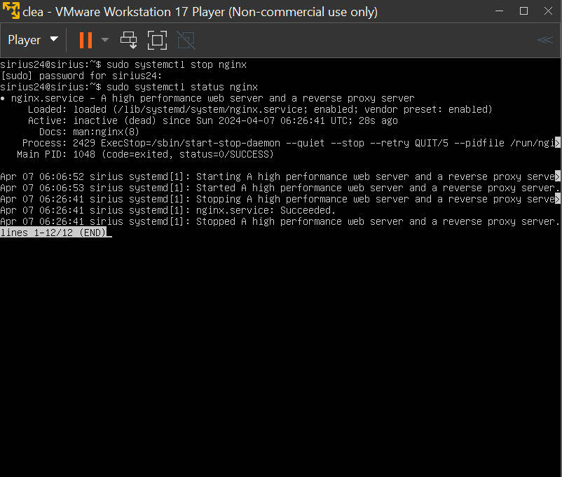
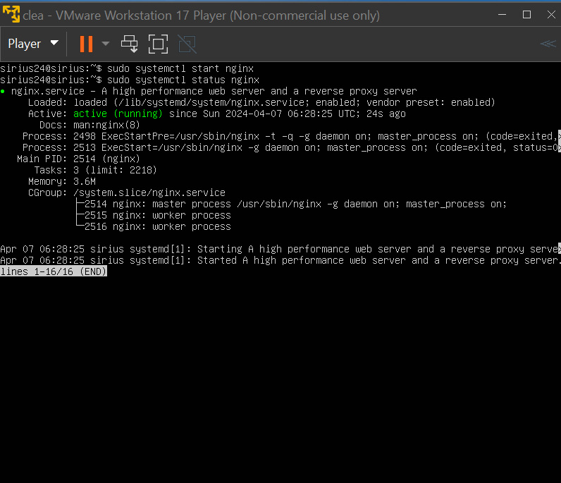

Week 1 task 2

1.  Perbedaan Ubuntu dan CenOS

- Ubuntu berbasis arsitektur Debian sedangkan CentOS berbasis Red Hat
  Enterprise Linux.

- Ubuntu jika ingin mengunduh sesuatu menggunakan apt-get sedangkan
  CentOS menggunakan yum.

- Ubuntu sering di update sedangkan CentOS sangat jarang, oleh karena
  itu CentOS lebih stabil, sehingga CentOS lebih stabil dan aman karena
  pembaruan yang tidak terlalu berkala.

- Ubuntu lebih mudah dipelajari dibandingkan CentOS.

- Ubuntu memiliki lebih banyak fitur dibandingkan CentOS.

2.  Perbedaan CLI dan GUI

- CLI hanya menggunakan teks sedangkan GUI menggunakan grafis dan
  visual.

- CLI antarmuka stabil dan konsisten sedangkan GUI sering terjadi
  pembaruan (upgrade) sehingga perlu membiasakan lagi dengan
  tampilannya.

- CLI lebih sulit dibangingkan GUI karena menggunakan coding, berbanding
  dengan GUI hanya perlu klik-klik saja.

- CLI membutuhkan penyimpanan yang lebih kecil dari GUI.

- CLI menyajikan kinerja dan performa yang lebih cepat dibanding GUI
  kerena.

- CLI hanya membutuhkan keyboard sedangkan GUI membutuhkan tambahan
  mouse.

- CLI memiliki tampilan yang tidak dapat diubah sedangkan GUI
  tampilannya dapat diubah sehingga menjadi lebih menarik.

3.  Nginx di VM

- Pastikan sudah melakukan sudo apt update dan sudo apt upgrade terlebih
  dahulu kemudian install nginx dengan perintah “sudo apt install nginx”

>  style="width:4.24684in;height:3.50907in" />
>
>  style="width:4.25316in;height:3.54022in" />

- Mengakses nginx melalui web browser dengan memasukkan ip

>  style="width:4.53164in;height:4.85096in" />

- Mengubah ip dengan perintah cd /etc/netplan lalu edit file
  00-installer-config.yaml

>  style="width:4.46835in;height:3.92429in" />
>
> Disini IP sudah dirubah ke 192.168.204.142, kemudian save dan exit.
> Setelah itu lakukan perintah “sudo netplan apply”, supaya konfigurasi
> yang telah diubah akan di apply.

- Mengakses kembali nginx di browser dengan IP yang telah diubah tadi

> 

4.  Fungsi systemctl adalah barus perintah yang memungkinkan pengelolaan
    dan pemantauan sistemd dan service manager. Systemctl alat yang
    sangat berguna dalam mengelola layanan server. Dengan systemctl,
    kita dapat menjalankan, mematikan atau memulai ulang suatu services
    di ubuntu seperti halnya task manager diwindows. Berikut adalah
    contoh command systemctl pada service nginx:

- Mengecek status service nginx apakah sudah berjalan atau tidak dengan
  perintah:

>  style="width:4.44304in;height:3.79671in" />

- Mematikan service nginx

>  style="width:4.45645in;height:3.78409in" />

- Memulai service nginx

>  style="width:4.50046in;height:3.87288in" />

- Untuk memulai ulang nginx dilakukan dengan perintah “systemctl reload
  nginx” atau “systemctl restart nginx”.
