Week 2 task 1

1.  Membuat 3 direktori yang masing masing berisi 2 file

- Untuk membuat direktori dilakukan dengan perintah mkdir

> 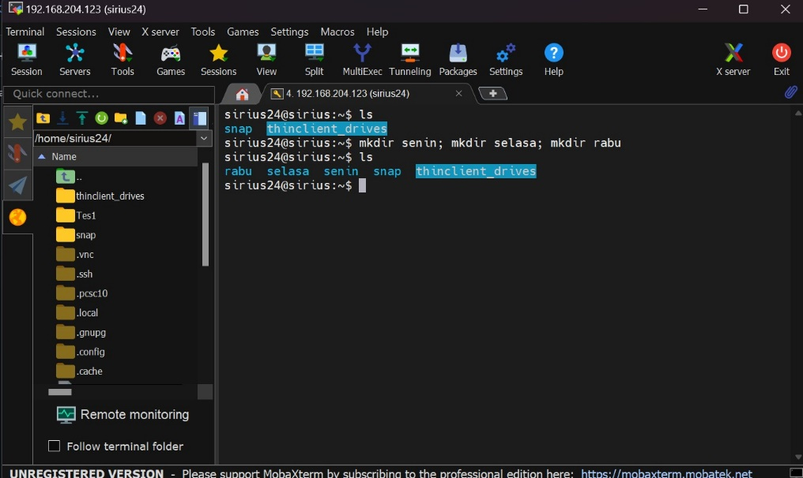 style="width:4.62593in;height:2.75885in" />
>
> Disini telah dibuat folder dengan nama senin, selasa dan rabu.

- Untuk membuat file dilakukan dengan perintah touch

> 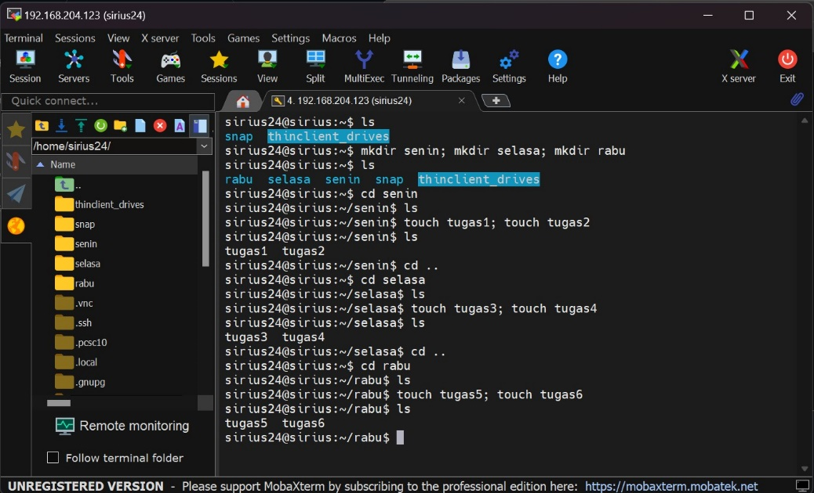 style="width:4.6962in;height:2.84342in" />
>
> Disini telah dibuat masing masing 2 file kedalam folder yang sudah
> dibuat tadi.

2.  Text manipulation melakukan manipulasi pada sebuah file dengan
    menggunakan terminal atau melakukan interaksi ke sistem dengan
    terminal. Misalnya membuat file, mengatur konfigurasi, scripting dan
    automasi, ststem administrasi, data processing, semua itu dapat
    dilakukan dengan text manipulation melalui terminal. Berikut adalah
    beberapa contoh command text manipulation:

- Cat, command ini berfungsi untuk menampilkan isi suatu file, dapat
  menulis isi file dan dapat menggabungkan isi file

> 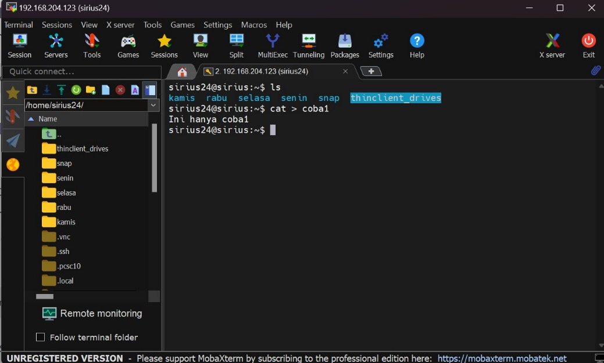 style="width:4.6962in;height:2.82834in" />
>
> Perintah “cat \> coba1” pada gambar diatas yaitu digunakan untuk
> menulis kedalam file coba1 (file coba1 akan otomatis dibuat jika tidak
> ada) dan untuk mengakhirinya cukup dengan ctrl+d. Untuk menampilkan
> isi file cukup dengan menggunakan perintah “cat coba1”
>
> 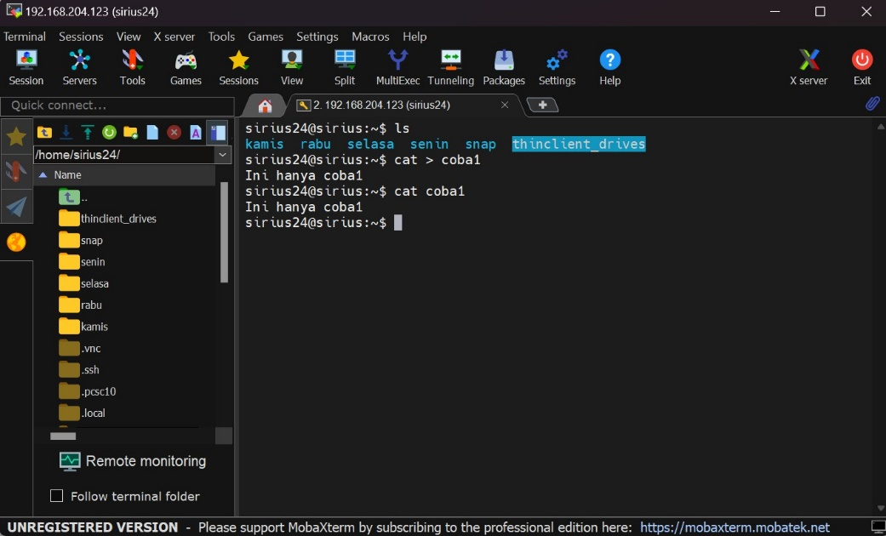 style="width:4.70479in;height:2.8481in" />
>
> Untuk menggabungkan isi file dan memasukkannya kedalam file baru
> menggunakan perintah:
>
> 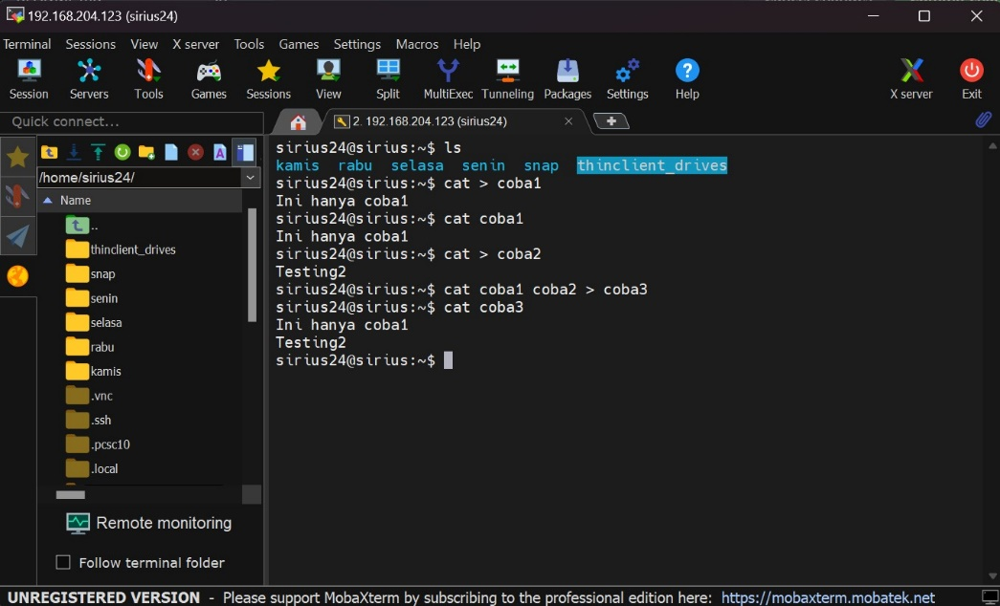 style="width:4.71519in;height:2.8591in" />
>
> Pada gambar diatas, file coba1 dan coba2 akan di gabung lalu
> dimasukkan kedalam file coba3.

- Sed, command ini digunakan untuk mengganti teks dalam suatu file
  dengan cepat, contoh command

> 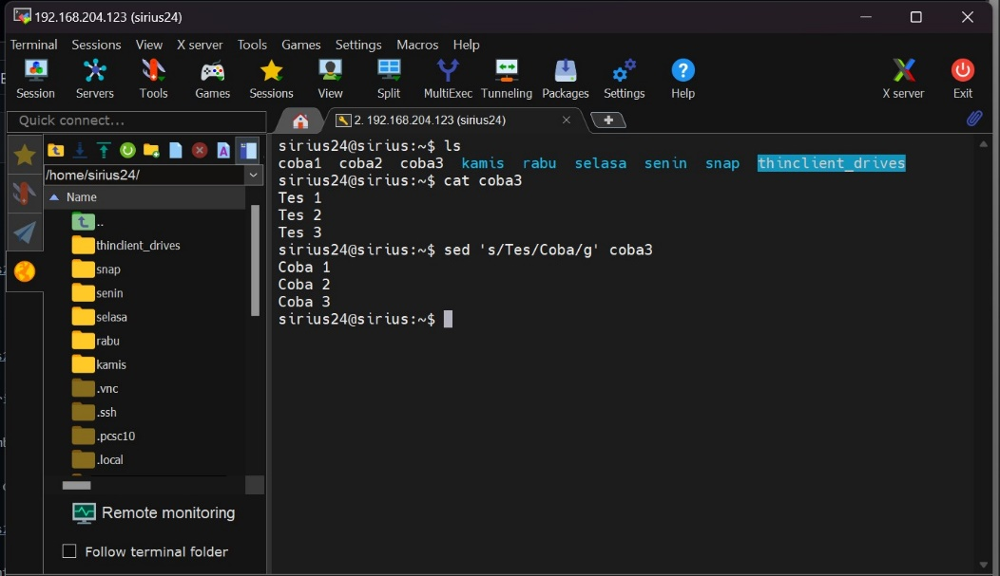 style="width:4.73418in;height:2.74316in" />
>
> Disini akan mengganti kata Tes mengganti kata Coba, untuk mengganti
> secara permanen maka tambahkan -i sesudah command sed.

- Grep, perintah untuk melakukan pencarian teks didalam sebuah file yang
  telah dibuat

> 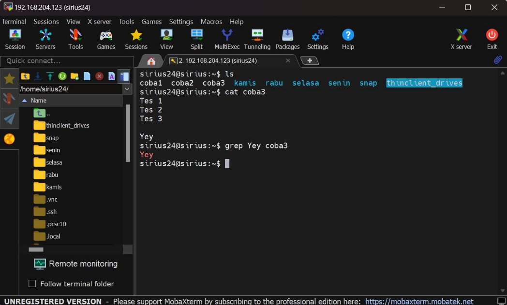 style="width:4.73418in;height:2.85173in" />
>
> Pada gambar diatas akan melakukan pencarian kata Yey didalam file
> coba3. Jika ingin mnghitung jumlah suatu kata dalam sebuah file maka
> tambahkan command -c sebelum command grep:
>
> 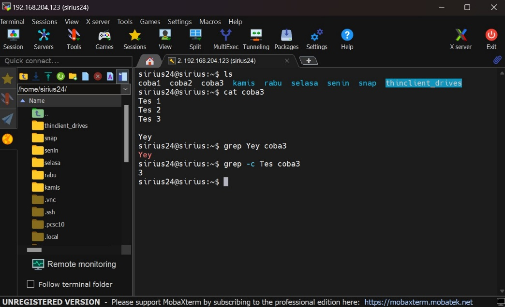 style="width:4.73403in;height:2.88206in" />

Jika ingin mencari kata Yey pada semua file maka cukup dengan perintah
“grep Yey \*

- Sort, digunakan untuk melakukan sorting dalam suatu file, baik itu
  ascending maupun descending. Perintah yang digunakan yaitu “sort
  namafile”, jika ingin melakukan descending maka tambahkan -r setelah
  command sort.

> 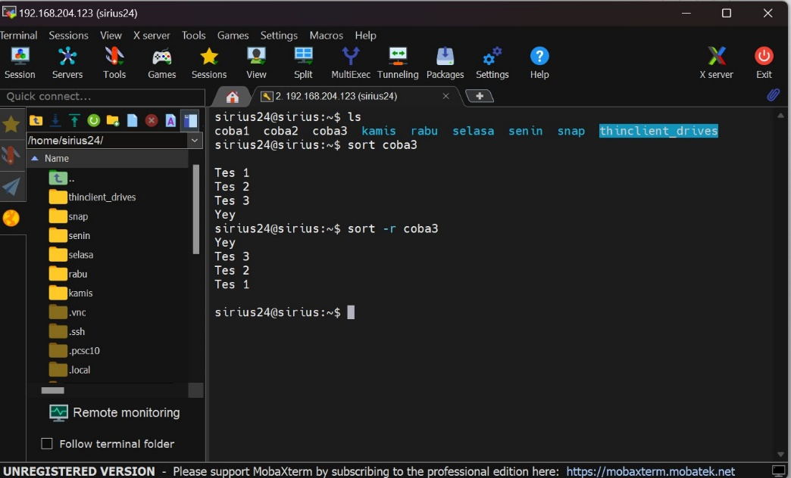 style="width:4.71519in;height:2.85701in" />

- Echo, perintah untuk menampilkan teks dan mencetak teks dalam suatu
  file

> 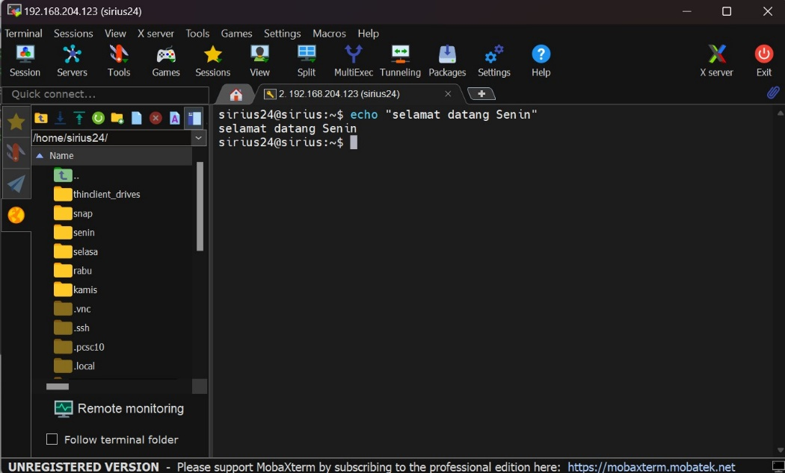 style="width:4.74684in;height:2.86251in" />
>
> Command pada gambar diatas digunakan untuk menampilkan teks sesuai
> perintah yaitu “selamat datang senin"
>
> 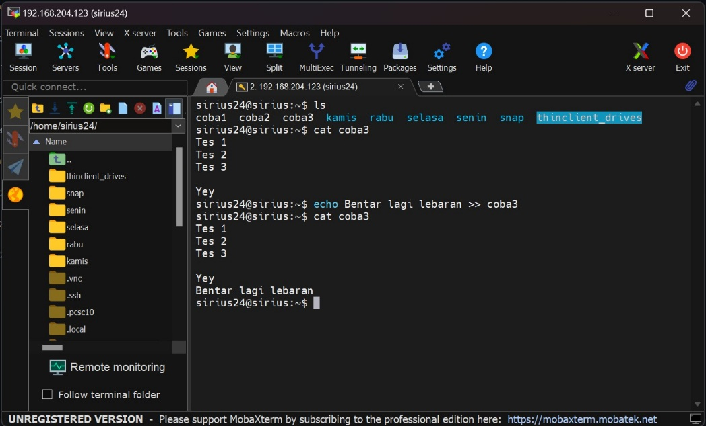 style="width:4.72152in;height:2.85614in" />
>
> Perintah “echo Bentar lagi lebaran \>\> coba3” akan menambahkan teks
> “Bentar lagi lebaran pada file coba3. Jika ingin menimpa semua isi
> dari file coba 3, maka gunakan hanya satu \> pada perintah diatas.

- Head and tail, head akan menampilan isi 10 baris pertama pada suatu
  file sedangkan tail akan menampilkan isi 10 baris terakhir pada suatu
  file.

> 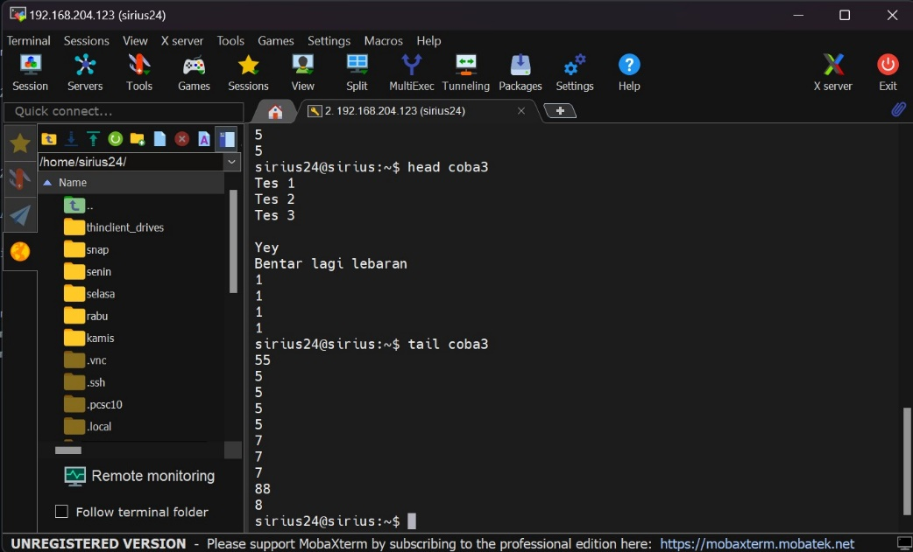 style="width:4.72083in;height:2.85938in" />

- Diff, perintah ini digunakan untuk membandingkan isi 2 file dan
  perbedaanya

> 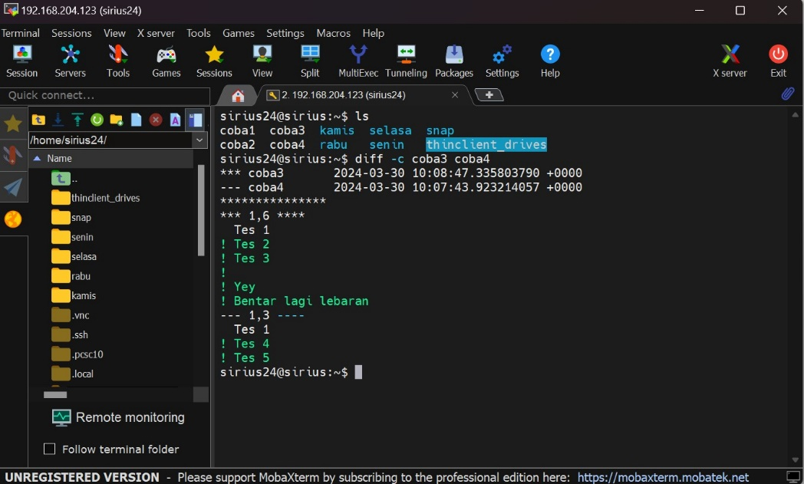 style="width:4.73418in;height:2.85173in" />
>
> Perintah diatas akan membandingkan file coba3 dan coba4 dan
> menampilkan perbedaanya.

3.  Htop adalah aplikasi pemantauan proses realtime yang sedang berjalan
    di sistem seperti penggunaan CPU, memory, aplikasi yang sedang
    berjalan dan proses lainnya selain itu kita juga dapat mengelola
    proses misalnya mematikan suatu proses. Htop ini merupakan pembaruan
    (upgrade) dari top karena lebih berwarna sehingga antarmuka
    penggunaannya lebih mudah. Htop ini mirip seperti task manager di OS
    Windows.

4.  Bash script untuk instalasi nginx.

- Membuat file .sh, kemudian masukkan isi perintah instalasi nginx
  didalamnya dan simpan.

> 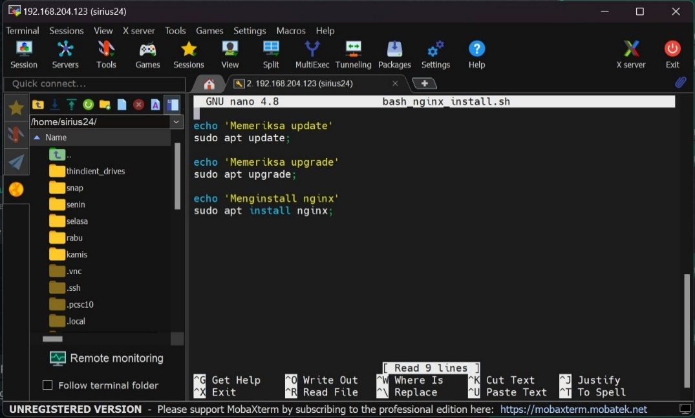 style="width:4.85443in;height:2.93815in" />

- Menjalankan file .sh tersebut

> 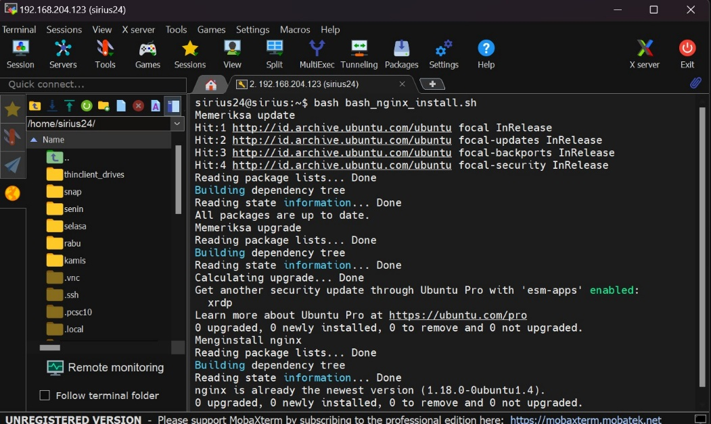 style="width:4.75316in;height:2.84368in" />
