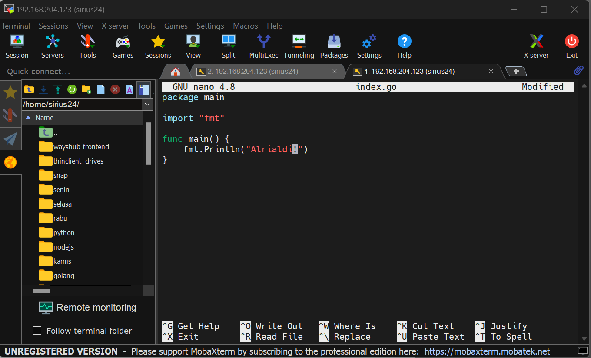

Week 3 task 1

1.  Perbandingan Monolith dan Microservices

- Monolith, cara pembuatan sistem yang menempatkan semua fungsi dan
  fitur dalam satu aplikasi tunggal yang besar. Aplikasi ini biasanya
  ditulis dalam satu Bahasa pemrograman, dijalankan di satu server dan
  diakses melalui satu endpoint. Ini merupakan cara yang paling mudah
  dan ceapt untuk membuat sistem karena semua komponen berada dalam
  suatu tempat.

- Monolith mudah di debug dan di maintenance karena semua komponen
  tersedia dalam satu aplikasi dan juga mudah di deploy karena hanya
  satu aplikasi yang perlu diperhatikan.

- Dalam Monolith, jika satu bagian mengalami masalah maka seluruh
  aplikasi akan terpengaruh.

- Microservice, model arsitektur apliaksi yang memisahkan aplikasi
  menjadi beberapa komponen yang independen yang dapat di deploy dan di
  ubah tanpa mempengaruhi komponen lainnya.

- Dalam Microservice, setiap komponen aplikasi (micoservice)
  diimplemantasikan sebagai apliakasi yang berdiri sendiri yang dapat
  dikembangkan, di deploy dan di ubah secara independen. Namun lebih
  sulit di debug dan di maintenance karena setiap komponen berada dalam
  lingkungan yang terpisah.

- Tidak seperti Monolith, pada Microservice, jika salah satu bagian
  dalam aplikasi mengalami masalah, maka hanya bagian itu yang
  terpengaruh sehingga mengurangi dampak pada seluruh sistem.

>  style="width:4.78472in;height:3.44611in" />

2.  Deploy aplikasi wayshub-frontend (NodeJS)

    Repositori: <https://github.com/dumbwaysdev/wayshub-frontend>

- Menyalin repository <https://github.com/dumbwaysdev/wayshub-frontend>
  ke server dengan cara “git clone”

>  style="width:5.06135in;height:3.06563in" />

- Setelah itu membuka dan mengedit package.json dari repositori tersebut

>  style="width:5.06839in;height:3.09404in" />
>
> 
>
> Disini tambahkan script “main”: “index.js”.

- Membuat index.js dan menambahkan script kedalamnya:

>  style="width:5.14809in;height:3.14041in" />

- Menjalankan aplikasi dengan perintah “npm run start”

>  style="width:5.33841in;height:3.23344in" />
>
>  style="width:5.34063in;height:3.22591in" />

- Terakhir, mengecek apakah sudah terhubung, dengan memasukkan ip:3000

>  style="width:4.99297in;height:2.71388in" />

3.  Deploy Golang & Pyton dengan menampilkan nama

<!-- -->

1.  Python

  - Membuat folder untuk menyimpan konfigurasi

>  style="width:4.46754in;height:2.71438in" />

  - Membuat file index.py dan menambahkan script kedalamnya

>  style="width:4.49171in;height:2.73205in" />
>
>  style="width:4.5299in;height:2.74725in" />

  - Menjalankan apliakasi dengan perintah python3 index.py

>  style="width:4.53282in;height:2.74501in" />

  - Mengakses aplikasi dengan perintah ip:5000

>  style="width:4.52254in;height:2.45468in" />

2.  Golang

  - Membuat folder untuk menyimpan konfigurasi

>  style="width:4.57262in;height:2.78329in" />

  - Membuat file index.go dan manambahkan script kedalamnya

>  style="width:4.58223in;height:2.8196in" />
>
>  style="width:4.58393in;height:2.78052in" />

  - Menjalankan aplikasi dengan perintah “go run index.go”

>  style="width:4.56746in;height:2.77408in" />
>
>  style="width:4.5582in;height:2.77098in" />
