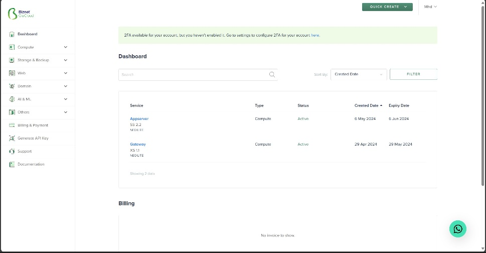

**STAGE 2**

Week 1 task 2

1.  Deploy database mysql

- Masuk ke server biznet appserver

>  style="width:4.38776in;height:2.28332in" />
>
>  style="width:4.44898in;height:2.41426in" />
>
>  style="width:4.44898in;height:2.33983in" />

- Menginstall mysql setelah melakukan update dan upgrade pada appserver

>  style="width:4.44218in;height:2.40958in" />

- Melakukan mysql secure installation yang betujuan untuk mengamankan
  mysql database dengan cara melakukan konfigurasi yaitu mengatur
  password untuk root

>  style="width:4.63946in;height:2.49655in" />
>
>  style="width:4.69388in;height:2.53883in" />

- Menambahkan password untuk root

>  style="width:4.6283in;height:2.68027in" />

- Masuk ke database mysql lalu buat user baru mysql

>  style="width:4.40136in;height:3.02331in" />
>
>  style="width:4.40136in;height:3.00722in" />

- Membuat database baru

>  style="width:4.65986in;height:2.69545in" />
>
>  style="width:4.68027in;height:2.69948in" />

- Mengatur agar user baru tadi dapat mengakses database yang telah
  dibuat sebelumnya

>  style="width:4.65464in;height:2.70068in" />

- Mengubah alamat bind-address pada konfigurasi mysql agar dapat di
  akses host lain

- Mencoba remote database dari host lain

>  style="width:4.67347in;height:2.62876in" />

2.  Deploy aplikasi Wayshub-Backend

- Melakukan clone repository Wayshub-Backend

>  style="width:4.73218in;height:2.2864in" />

- Menginstal Node 14

>  style="width:4.69964in;height:4.03525in" />

- Mengatur konfigurasi di wayshub backend sesuai database yang telah
  dibuat

>  style="width:4.40818in;height:4.97959in" />
>
>  style="width:4.44384in;height:4.98639in" />
>
>  style="width:4.41511in;height:4.97959in" />

- Install sequelize-cli

>  style="width:4.39098in;height:4.95238in" />

- Melakukan running migration

>  style="width:4.47619in;height:4.10226in" />

- Deploy app menggunakan PM2

>  style="width:4.4197in;height:4.43537in" />
>
>  style="width:4.44898in;height:1.26579in" />
>
>  style="width:4.40818in;height:4.97959in" />
>
>  style="width:4.44218in;height:2.41057in" />
