**STAGE 2**

Week 1 task 3

1.  Menginstall nginx

> 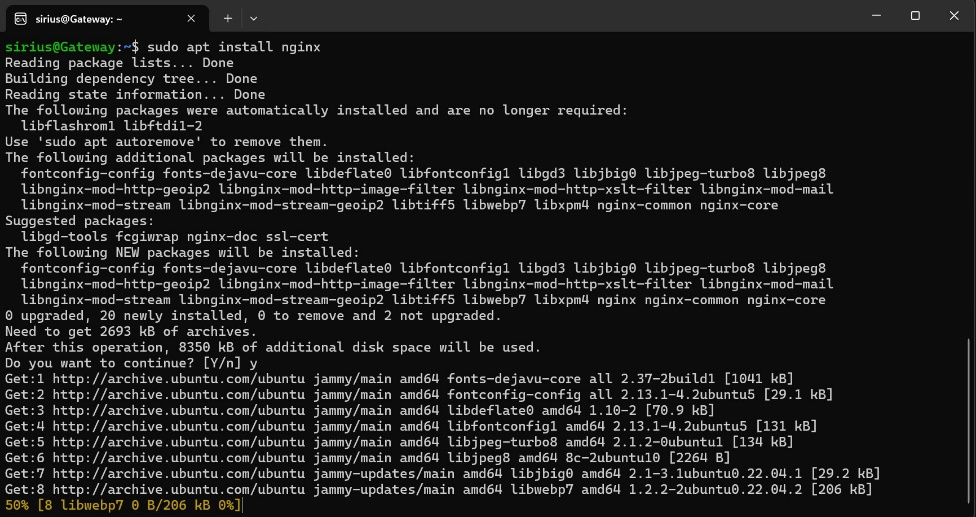 style="width:4.42215in;height:2.34091in" />

2.  Membuat reverse proxy dengan nama masing-masing

- Masuk ke direktori /etc/nginx/ lalu buat sebuah folder apps

> 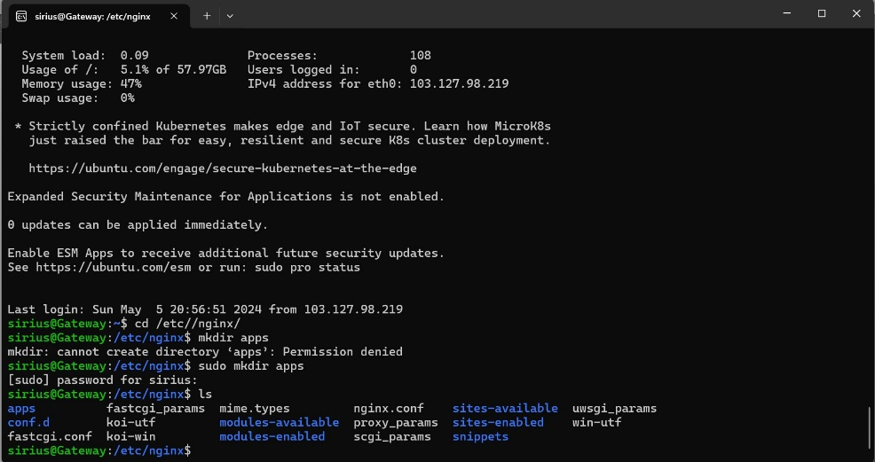 style="width:4.45175in;height:2.35263in" />

- Kemudian masuk ke folder tersebut lalu buat sebuh file konfigurasi
  untuk reverse proxy

> 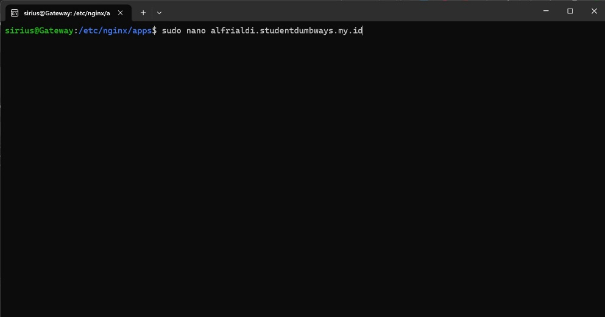 style="width:4.48947in;height:2.35367in" />

- Berikut isi file konfigurasinya

> 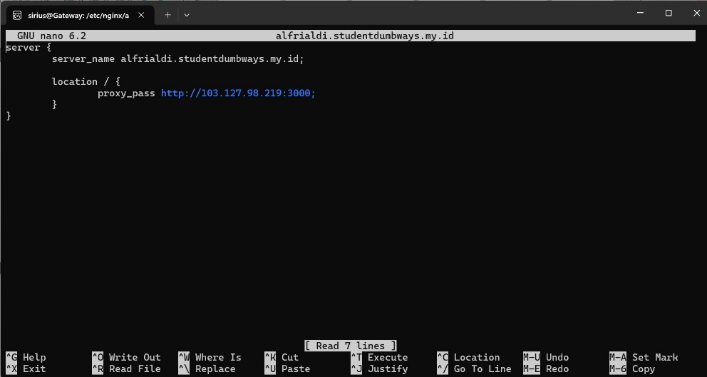 style="width:4.47642in;height:2.38947in" />

- Kembali ke direktori nginx, lalu buka file nginx.conf untuk
  menambahkan konfigurasi reverse proxy yang sudah dibuat tadi

> 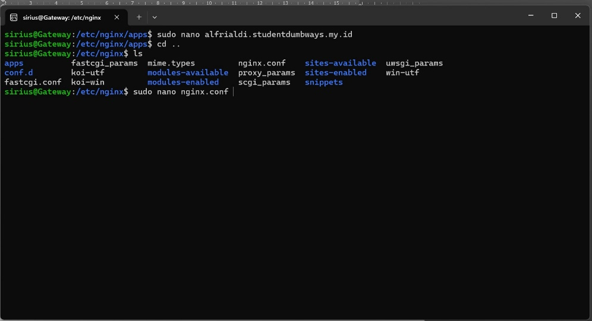 style="width:4.51053in;height:2.44666in" />

- Pada bagian include, tambahkan direktori apps tadi

> 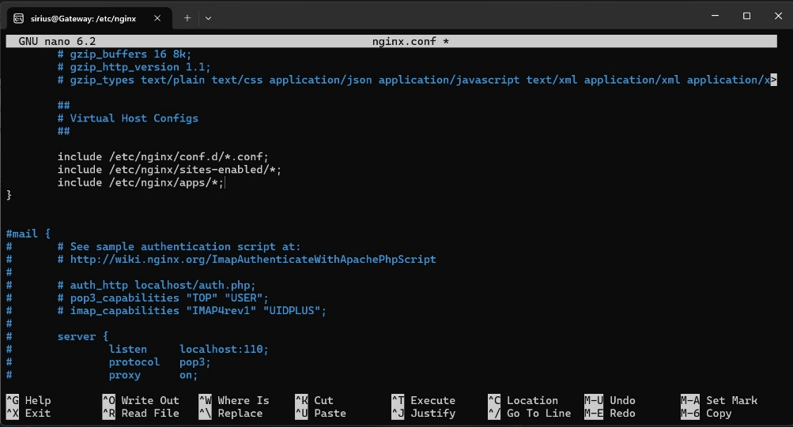 style="width:4.5271in;height:2.44211in" />

- Buka cloudflare dumbways, lalu klik pada bagian dns dan tambahkan dns
  sesuai nama reverse proxy yang sudah dibuat tadi dan ip yang sesuai

> 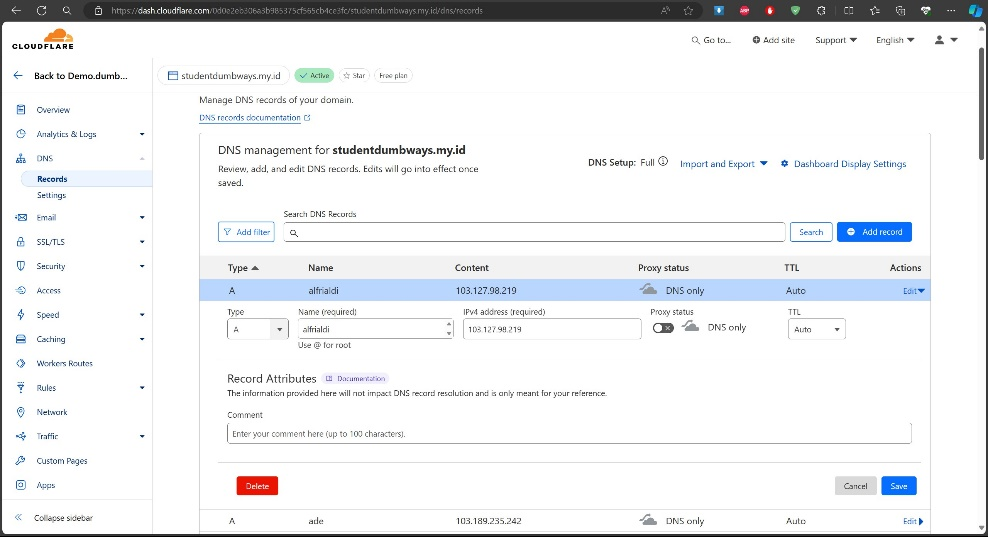 style="width:4.47368in;height:2.43064in" />

- Pastikan konfigurasi sudah benar

> 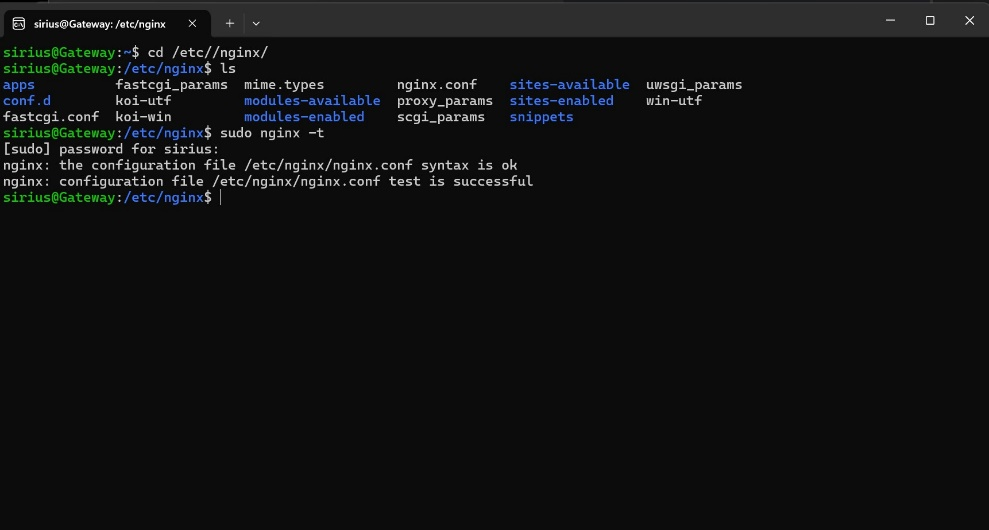 style="width:4.47895in;height:2.39876in" />

- Lakukan reload pada systemctl nginx

> 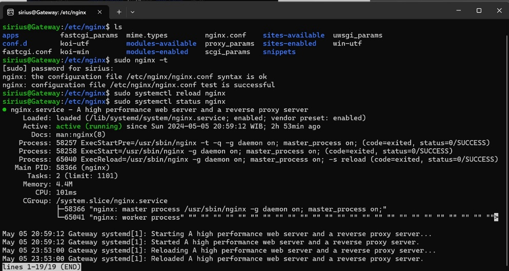 style="width:4.49227in;height:2.38947in" />

- Mengecek apakah server dan reverse proxy sudah berjalan dengan pm2 ls

> 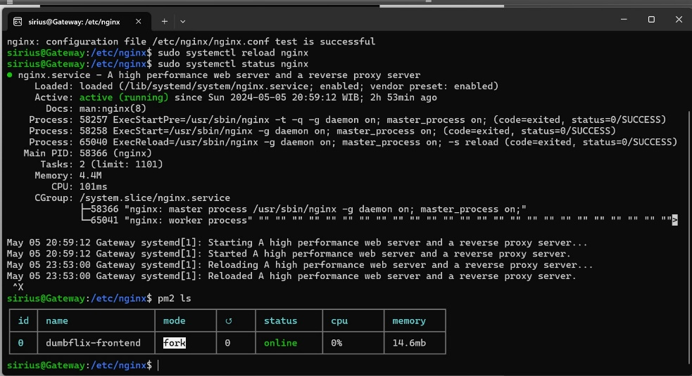 style="width:4.44737in;height:2.4193in" />

- Akses ke domain reverse proxy

> 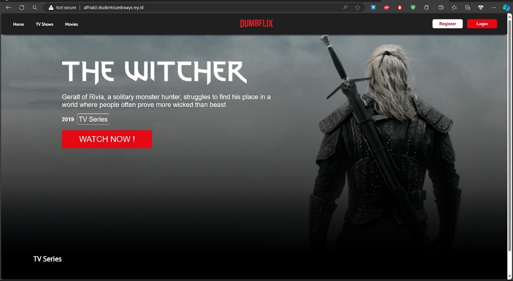 style="width:4.51053in;height:2.46815in" />

3.  Generate SSL untuk reverse proxy

- Menginstall certbot

> 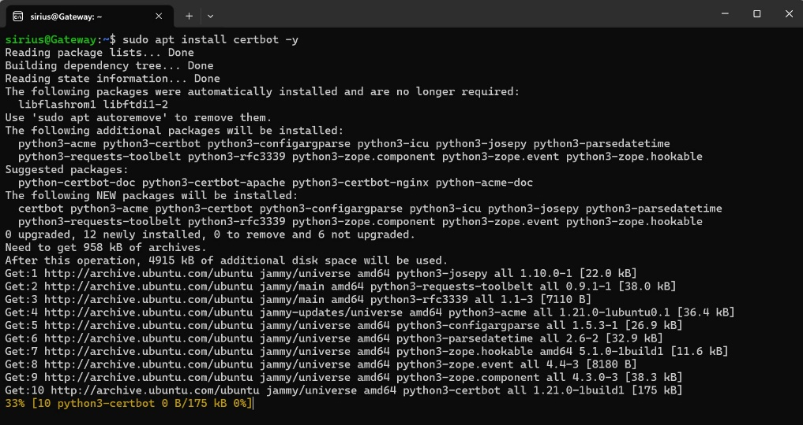 style="width:4.55901in;height:2.42245in" />

- Menginstall plugin certbot untuk nginx

> 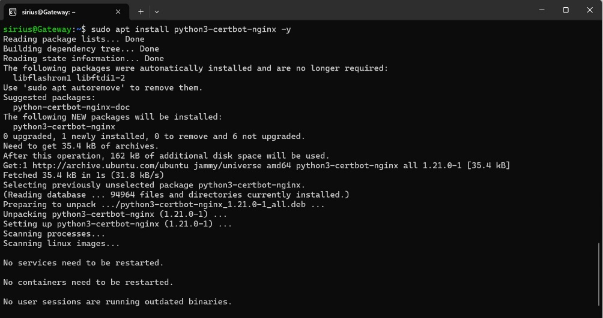 style="width:4.54037in;height:2.40098in" />

- Melakukan generate SSL dengan menggunakan certbot (dari lets encrypt)

> 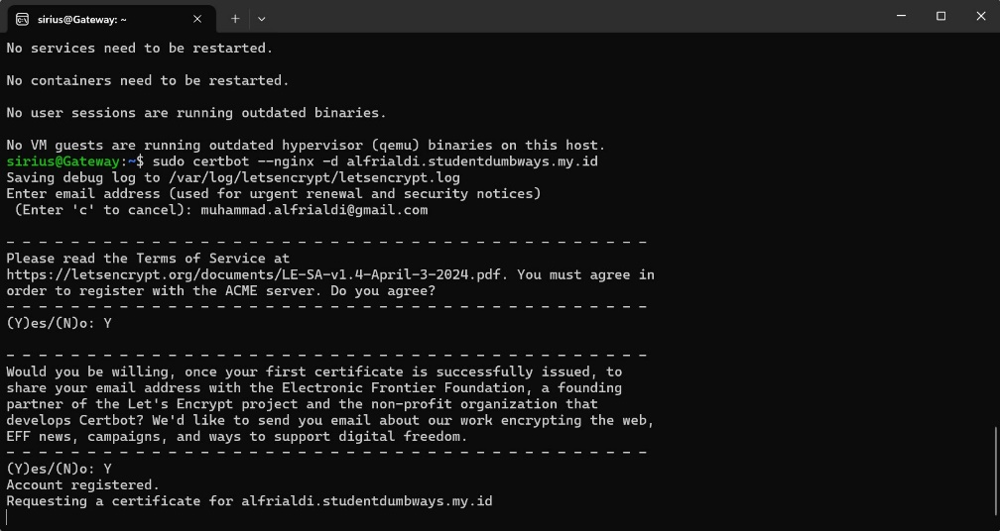 style="width:4.56522in;height:2.42828in" />
>
> 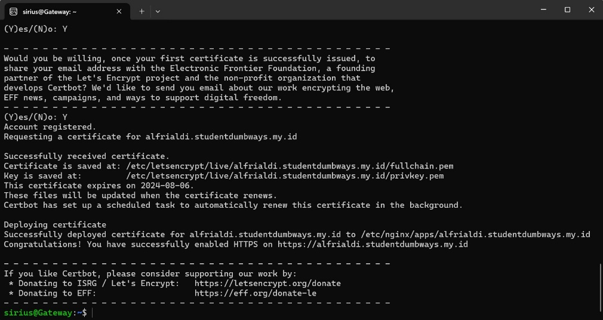 style="width:4.55901in;height:2.4174in" />

- Mengkases kembali ke domain

> 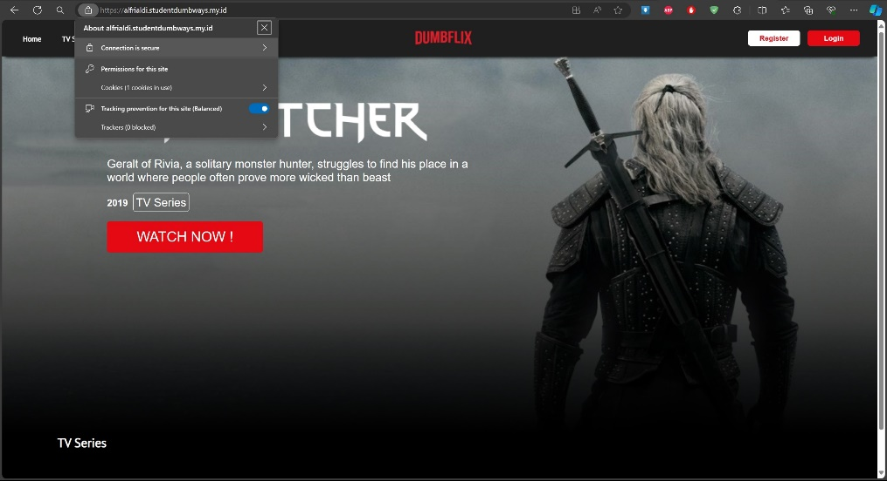 style="width:4.57823in;height:2.49099in" />
